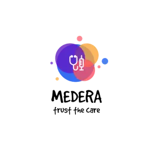

# Hello Future 2.0 Hackathon 2024 <!-- omit from toc -->

---

## Project Name: _Medera_ <!-- omit from toc -->

---

## Table of Contents <!-- omit from toc -->

- [Project Overview](#project-overview)
- [Deployed Links](#deployed-links)
- [Repositories and Links](#repositories-and-links)
- [Pitch Deck](#pitch-deck)
- [Demo](#demo)
- [Architecture](#architecture)
- [Contributors](#contributors)

---

## Project Overview

**Medera** aims to revolutionize healthcare by leveraging the power of distributed ledger technology (DLT). Using the **Hedera** network, we ensure secure, transparent, and decentralized healthcare solutions.

---

## Deployed Links

| Service                  | URL                                                                                                  | Description                                                                                               |
| ------------------------ | ---------------------------------------------------------------------------------------------------- | --------------------------------------------------------------------------------------------------------- |
| Medera Clinic Frontend   | [https://medera-clinic-frontend.vercel.app](https://medera-clinic-frontend.vercel.app/)              | The frontend service for the Medera Clinic project.                                                       |
| Medera Pharmacy Frontend | [https://medera-pharmacy-frontend.vercel.app](https://medera-pharmacy-frontend.vercel.app/)          | The frontend service for the Medera Pharmacy project.                                                     |
| Medera Mobile Wallet     | [Medera Mobile Wallet APK](https://drive.google.com/file/d/1MoS4d-ALYpfBKiljtm_-G1peWmLyeC6V/view)   | The mobile wallet for the Medera project.                                                                 |
| Medera Backend           | [https://medera-backend.onrender.com/api](https://medera-backend.onrender.com/api)                   | The backend service for the Medera project.                                                               |
| Medera Trust Registry    | [https://hashscan.io/testnet/contract/0.0.5256922](https://hashscan.io/testnet/contract/0.0.5256922) | The TrustRegistry is a smart contract that provides functionality for managing a registry of Hedera DIDs. |

---

## Repositories and Links

> Note: Each of the following repositories contains detailed information about the project, including installation instructions and more.

1.  [Hedera Credo Module](https://github.com/sairanjit/hedera-credo-module)

- The Hedera Credo Module is a TypeScript library that integrates the Hedera Consensus Service with the Credo framework, enabling developers to build decentralized applications (dApps) that leverage Hedera's fast, fair, and secure consensus mechanism. It also facilitates Self-Sovereign Identity (SSI) solutions by allowing the creation and resolution of decentralized identifiers (DIDs).

3.  [Medera Trust Registry](https://github.com/tipusinghaw/medera-trust-registry)

- The TrustRegistry is a smart contract that provides functionality for managing a registry of Hedera DIDs (Decentralized Identifiers) and their associated resources. Resources can include schemas, URLs, or other relevant metadata. The contract enables adding, removing, and retrieving resources linked to specific DIDs while maintaining an organized list of all DIDs.

4.  [Medera Backend](https://github.com/GHkrishna/medera-backend)

- This repository contains the backend service for the Medera project, a healthcare solution built using the Hedera Hashgraph platform. The application is developed using NestJS, providing a scalable, efficient, and modular backend framework.

5.  [Medera Clinic Frontend](https://github.com/pranalidhanavade/medera-clinic-frontend)

- This repository contains the frontend service for the Medera Clinic project, a healthcare solution built using the Hedera Hashgraph platform. The application is developed using Next.js and Tailwind CSS, providing a modern, responsive, and user-friendly interface.

6.  [Medera Pharmacy Frontend](https://github.com/pranalidhanavade/medera-pharmacy-frontend)

- This repository contains the frontend service for the Medera Pharmacy project, a healthcare solution built using the Hedera Hashgraph platform. The application is developed using Next.js and Tailwind CSS, providing a modern, responsive, and user-friendly interface.

7.  [Medera Mobile Wallet](https://github.com/sairanjit/medera-wallet)

- This repository contains the mobile wallet for the Medera project, a healthcare solution built using the Hedera Hashgraph platform. The application is developed using React Native.(We have started the development of the Medera mobile wallet from the adeya-wallet repository and proceed to make the changes to the codebase to suit the requirements of the hackathon and to add the functionalities required for the hackathon for the hedera credo Module and hbar payment module.)

---

## Pitch Deck

> Note: The pitch deck will be uploaded soon.

---

## Demo

> Note: The demo video will be uploaded soon.

---

## Architecture

---

## Contributors

1. [Pranali Dhanavade](https://github.com/pranalidhanavade)
2. [Krishna Waske](https://github.com/GHkrishna)
3. [Tipu Singh](https://github.com/tipusinghaw)
4. [Sai Ranjit Tummalapalli](https://github.com/sairanjit)

---
